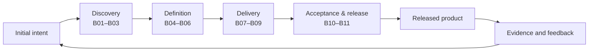
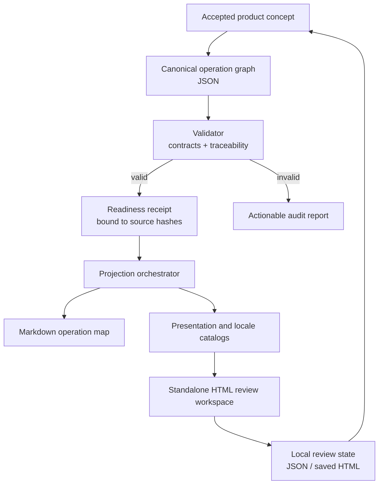

# TASKPLAN PRO Operation Map

[Русская версия](README.ru.md) · [npm](https://www.npmjs.com/package/taskplan-pro-operation-map) · [Security](SECURITY.md) · [License](LICENSE)

TASKPLAN PRO Operation Map is a local-first agent skill and command-line tool
that turns an accepted product concept into a machine-checkable operational
graph. It makes the route from intent to release inspectable: every block,
step, artifact, gate, and failure path has a stable identity, explicit input,
expected output, success criteria, failure criteria, and recovery action.

This repository is source-available for non-commercial use. Commercial use
requires prior written permission from the copyright holder. See [License](#license).

## What it does

The tool creates one canonical JSON graph and derives human and UI projections
from it. The graph can represent the complete product path:



It is designed for product work where an LLM or a team of agents must not jump
from a vague request straight into an oversized implementation task. It does
not execute your entire project by itself. It provides the validated map,
readiness evidence, review workspace, and skill instructions that an agent or
orchestrator uses to plan and review the work.

## How the modules work



The package contains these modules:

- `operation_map.py` coordinates validation, readiness checks, and deterministic
  output generation.
- JSON contracts define the graph, readiness receipt, presentation, locale,
  review-state, and build-manifest formats.
- `locale_catalog.py` manages RU/EN/ES/FR/DE interface catalogs and translation
  provenance.
- `review_workspace.py` builds the self-contained HTML projection.
- `SKILL.md` tells a compatible coding agent when to decompose a concept, when
  to stop, and which evidence is required before rendering.

Typical outputs are `OPERATION-MAP-AUDIT.json`, `OPERATION-MAP.md`,
`OPERATION-MAP-PRESENTATION.json`, `OPERATION-MAP-I18N.json`,
`OPERATION-MAP-REVIEW.html`, and `OPERATION-MAP-BUILD.json`.

## What the interface shows

### 1. The whole product pipeline


The overview groups eleven product blocks into Discovery, Definition, Delivery,
and Acceptance & Release. Each block exposes its principal input, output,
implementation state, review progress, and gate state. `Main pipeline` keeps
the view readable; `All relations` reveals correction and failure links.

### 2. Drill-down into one block


Opening a block reveals the working graph. Steps are connected to artifacts,
decisions, gates, and explicit failure routes. The inspector explains what the
selected node does, why it exists, what must enter, what must leave, and how
success or failure is judged.

### 3. Review an individual node


Every node has a stable ID and five independent review fields: owner
observation, discussion question, proposed solution, and comments from two
reviewers. Review state stays local in the browser and can be exported as JSON
or embedded in a saved standalone HTML file.

## Why this is more than an LLM wiki or RAG

An LLM wiki preserves and retrieves project knowledge. RAG finds relevant
fragments for a model. Both are useful, and this tool can consume their
evidence. Neither, by itself, proves that a product path is complete or that
an implementation task has an input, measurable output, gate, owner, failure
route, and traceability to the accepted concept.

TASKPLAN PRO Operation Map adds that operational layer:

| LLM wiki / RAG | TASKPLAN PRO Operation Map |
|---|---|
| Retrieves relevant knowledge | Validates a connected execution model |
| Organizes documents and context | Organizes blocks, steps, artifacts, gates, and failures |
| Answers “what do we know?” | Answers “what happens next, why, and how is it accepted?” |
| Can return incomplete or stale evidence | Emits explicit validation failures and source-bound receipts |
| Primarily a knowledge interface | A reviewable contract between concept, agents, and UI |

This is complementary infrastructure, not a replacement for a project wiki,
RAG system, source control, tests, or human product judgment.

## Who it is for

- Solo developers turning an early idea into an implementation-ready product.
- Product architects who need traceability from user pain to release evidence.
- Agentic coding teams that require bounded handoffs and machine-readable gates.
- Reviewers who need to discuss a large system node by node without editing the
  canonical source directly.
- Teams that want one data model projected into Markdown, HTML, a VS Code
  extension, or another UI without hardcoding product logic into the interface.

## What the user gets

- A compact, canonical graph instead of several drifting planning documents.
- Early discovery of missing inputs, orphaned outputs, broken traceability, and
  undefined failure recovery.
- A navigable standalone HTML file that can be reviewed or shared as a snapshot.
- Stable review comments that survive layout changes because they bind to IDs.
- A deterministic contract that future dashboards and agent runtimes can read.

## Requirements

- Node.js 18 or newer for the npm launcher.
- Python 3.10 or newer in `PATH` for the operation-map engine.
- A modern browser for the standalone review workspace.

The npm package has no runtime JavaScript dependencies, install hooks, telemetry,
or required backend.

## Installation

Install the CLI globally:

```bash
npm install --global taskplan-pro-operation-map
taskplan-operation-map --help
```

Or run it without a global install:

```bash
npx taskplan-pro-operation-map --help
```

To use it as an agent skill, copy the published `skill/` directory into your
agent runtime's skill directory and invoke `taskplan-pro-operation-map` by name.
The exact skill-directory path depends on the host (Codex, Claude, or another
compatible agent runtime); it is intentionally not hardcoded by this package.

## Usage

Validate a graph and its traceability to an accepted concept:

```bash
taskplan-operation-map validate \
  --graph path/to/OPERATION-MAP.json \
  --concept path/to/CONCEPT.md \
  --report build/OPERATION-MAP-AUDIT.json
```

Create the generic deterministic projections:

```bash
taskplan-operation-map finalize \
  --graph path/to/OPERATION-MAP.json \
  --concept path/to/CONCEPT.md \
  --output-dir build/operation-map
```

Create the review workspace after an approved readiness receipt exists:

```bash
taskplan-operation-map review \
  --graph path/to/OPERATION-MAP.json \
  --concept path/to/CONCEPT.md \
  --readiness-receipt path/to/OPERATION-MAP-READINESS.json \
  --output-dir build/review \
  --source-locale en
```

The review command deliberately refuses to bypass the readiness contract. Read
[`skill/SKILL.md`](skill/SKILL.md) and the contracts in `skill/references/` for
the complete workflow and stop conditions.

## Risks and limitations

- A rigorously structured map can still encode the wrong product. The accepted
  concept and real user journeys remain the primary truth.
- A readiness receipt proves contract compliance and source identity, not that
  human evidence is honest or sufficient.
- Machine-translated content must retain provenance and may require human review.
- Browser autosave uses local storage. Use JSON export or `Save HTML` for a
  portable backup; clearing browser data can remove unsaved local state.
- Dense relation graphs require zoom and filtering, especially on small screens.
- Imported project files may contain sensitive material. The tool is local-first,
  but exported HTML and JSON remain as sensitive as their source.
- Python is a runtime requirement; npm does not download or install it.
- This version provides the operation-map/review vertical slice. It is not the
  complete TASKPLAN PRO planning and multi-agent execution platform.

## Development

```bash
npm test
npm pack --dry-run
```

Tests cover the npm launcher, the public package allowlist, graph validation,
localization contracts, and the skill's Python implementation.

## License

Copyright © 2026 Serge Kostenchuk.

Non-commercial use is permitted under the
[TASKPLAN PRO Non-Commercial License 1.0](LICENSE). Commercial use—including
internal use by a for-profit organization, paid client work, consulting, resale,
hosting, SaaS, or inclusion in a commercial product—requires prior written
permission from the copyright holder.

This is **source-available software, not OSI-approved open-source software**.
