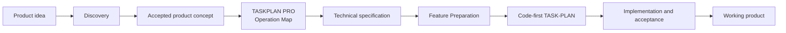
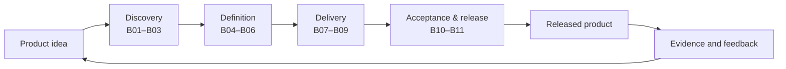
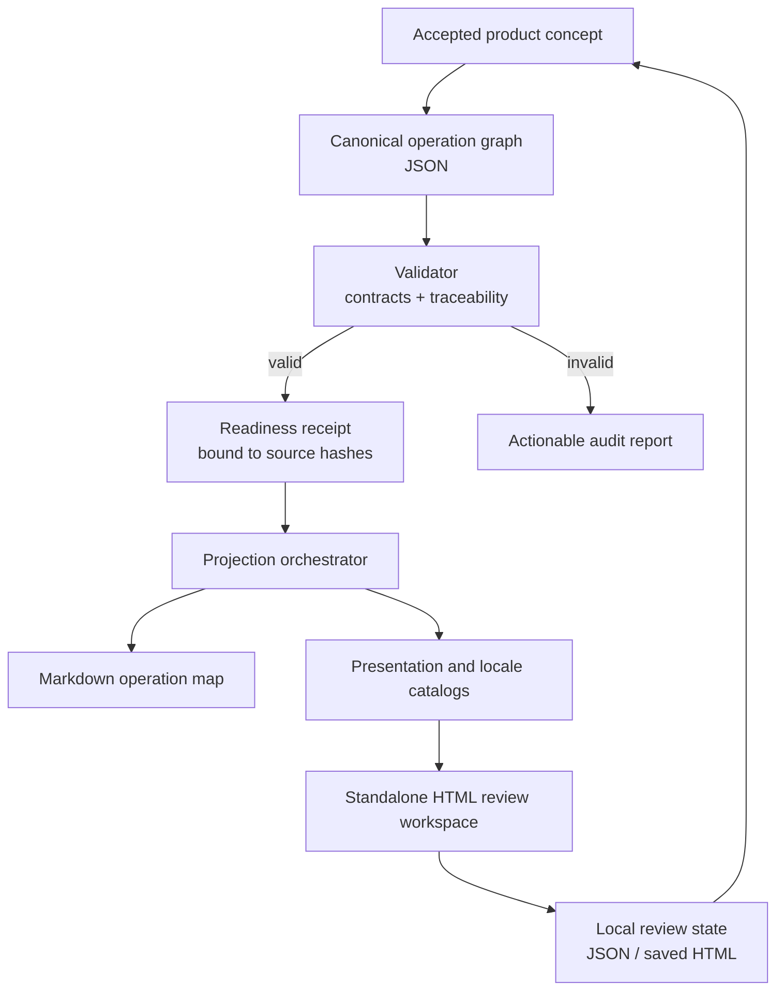

# TASKPLAN PRO Operation Map

[Русская версия](README.ru.md) · [npm](https://www.npmjs.com/package/taskplan-pro-operation-map) · [Security](SECURITY.md) · [License](LICENSE)

TASKPLAN PRO Operation Map is both a **vendor-neutral agent skill for Codex,
Claude Code, and other compatible coding-agent environments** and a
**standalone module of the broader TASK-PLAN PRO framework**. It turns an
accepted product concept into a machine-checkable operational map of the
complete product journey.

This repository contains the Operation Map skill, its deterministic local CLI,
and its review workspace. It does **not** contain or claim to be the complete
TASK-PLAN PRO product.

This repository is licensed under the Business Source License 1.1. Non-commercial
production use is permitted by the Additional Use Grant; commercial production
use requires a separate license. See [License](#license).

## Where it fits



This package implements only the highlighted Operation Map module. The other
stages belong to the broader TASK-PLAN PRO architecture and are outside this
package's current scope.

## What the module does

The tool creates one canonical JSON graph and derives human and UI projections
from it. The graph can represent the complete product path:



The module detects missing stages, unsupported transitions, incomplete
success/failure contracts, orphaned outputs, and broken traceability before
those defects reach the technical specification, TASK-PLAN, or code. It does
not execute the entire project by itself.

## How the modules work



The package contains these modules:

- `operation_map.py` coordinates validation, readiness checks, and deterministic
  output generation.
- JSON contracts define the graph, readiness receipt, presentation, locale,
  review-state, and build-manifest formats.
- `locale_catalog.py` manages RU/EN/ES/FR/DE interface catalogs and translation
  provenance.
- `review_workspace.py` builds the self-contained HTML projection.
- `SKILL.md` tells a compatible coding agent when to decompose a concept, when
  to stop, and which evidence is required before rendering.

Typical outputs are `OPERATION-MAP-AUDIT.json`, `OPERATION-MAP.md`,
`OPERATION-MAP-PRESENTATION.json`, `OPERATION-MAP-I18N.json`,
`OPERATION-MAP-REVIEW.html`, and `OPERATION-MAP-BUILD.json`.

## What the interface shows

### 1. The whole product pipeline


The overview groups eleven product blocks into Discovery, Definition, Delivery,
and Acceptance & Release. Each block exposes its principal input, output,
implementation state, review progress, and gate state. `Main pipeline` keeps
the view readable; `All relations` reveals correction and failure links.

### 2. Drill-down into one block


Opening a block reveals the working graph. Steps are connected to artifacts,
decisions, gates, and explicit failure routes. The inspector explains what the
selected node does, why it exists, what must enter, what must leave, and how
success or failure is judged.

### 3. Review an individual node


Every node has a stable ID and five independent review fields: owner
observation, discussion question, proposed solution, and comments from two
reviewers. Review state stays local in the browser and can be exported as JSON
or embedded in a saved standalone HTML file.

## Relationship to project knowledge systems

Project documentation, wikis, and retrieval systems may supply evidence to the
skill. They are neither the reason this module exists nor its replacement. The
module's responsibility is narrower: prove the operational completeness and
traceability of an accepted product concept before downstream development.

## Who it is for

- Solo developers turning an early idea into an implementation-ready product.
- Product architects who need traceability from user pain to release evidence.
- Agentic coding teams that require bounded handoffs and machine-readable gates.
- Reviewers who need to discuss a large system node by node without editing the
  canonical source directly.
- Teams that want one data model projected into Markdown, HTML, a VS Code
  extension, or another UI without hardcoding product logic into the interface.

## What the user gets

- A compact, canonical graph instead of several drifting planning documents.
- Early discovery of missing inputs, orphaned outputs, broken traceability, and
  undefined failure recovery.
- A navigable standalone HTML file that can be reviewed or shared as a snapshot.
- Stable review comments that survive layout changes because they bind to IDs.
- A deterministic contract that future dashboards and agent runtimes can read.

## Requirements

- Node.js 18 or newer for the npm launcher.
- Python 3.10 or newer in `PATH` for the operation-map engine.
- A modern browser for the standalone review workspace.

The npm package has no runtime JavaScript dependencies, install hooks, telemetry,
or required backend.

## Installation

Install the CLI globally:

```bash
npm install --global taskplan-pro-operation-map
taskplan-operation-map --help
```

Or run it without a global install:

```bash
npx taskplan-pro-operation-map --help
```

## Use as an agent skill

The published `skill/` directory is the single canonical vendor-neutral skill
bundle. Do not fork its instructions per vendor.

- **Codex:** install the `skill/` directory as
  `$CODEX_HOME/skills/taskplan-pro-operation-map` (Codex defaults
  `$CODEX_HOME` to `~/.codex`). Invoke `$taskplan-pro-operation-map`.
- **Claude Code:** install it as either the project skill
  `.claude/skills/taskplan-pro-operation-map` or the personal skill
  `~/.claude/skills/taskplan-pro-operation-map`. Invoke
  `/taskplan-pro-operation-map` or let Claude select it from its description.
- **Other compatible agents:** install the complete directory wherever that
  host discovers Agent Skills-compatible bundles. The host must preserve
  `SKILL.md`, `references/`, `contracts/`, and `scripts/` together and provide
  local filesystem access plus Python 3.10 or newer.

See [`docs/vendors/`](docs/vendors/) for vendor-specific installation,
invocation, capability, and verification notes.

## Real self-hosted example

[`examples/self-hosted/`](examples/self-hosted/) contains a source-backed
example in which the released module describes and validates its own workflow.
It is explicitly not a fictional product scenario and not a claim that the
complete TASK-PLAN PRO framework is implemented.

## Usage

Validate a graph and its traceability to an accepted concept:

```bash
taskplan-operation-map validate \
  --graph path/to/OPERATION-MAP.json \
  --concept path/to/CONCEPT.md \
  --report build/OPERATION-MAP-AUDIT.json
```

Create the generic deterministic projections:

```bash
taskplan-operation-map finalize \
  --graph path/to/OPERATION-MAP.json \
  --concept path/to/CONCEPT.md \
  --output-dir build/operation-map
```

Create the review workspace after an approved readiness receipt exists:

```bash
taskplan-operation-map review \
  --graph path/to/OPERATION-MAP.json \
  --concept path/to/CONCEPT.md \
  --readiness-receipt path/to/OPERATION-MAP-READINESS.json \
  --output-dir build/review \
  --source-locale en
```

The review command deliberately refuses to bypass the readiness contract. Read
[`skill/SKILL.md`](skill/SKILL.md) and the contracts in `skill/references/` for
the complete workflow and stop conditions.

## Risks and limitations

- A rigorously structured map can still encode the wrong product. The accepted
  concept and real user journeys remain the primary truth.
- A readiness receipt proves contract compliance and source identity, not that
  human evidence is honest or sufficient.
- Machine-translated content must retain provenance and may require human review.
- Browser autosave uses local storage. Use JSON export or `Save HTML` for a
  portable backup; clearing browser data can remove unsaved local state.
- Dense relation graphs require zoom and filtering, especially on small screens.
- Imported project files may contain sensitive material. The tool is local-first,
  but exported HTML and JSON remain as sensitive as their source.
- Python is a runtime requirement; npm does not download or install it.
- This version provides the operation-map/review vertical slice. It is not the
  complete TASKPLAN PRO planning and multi-agent execution platform.

## Development

```bash
npm test
npm pack --dry-run
```

Tests cover the npm launcher, the public package allowlist, graph validation,
localization contracts, and the skill's Python implementation.

## License

Copyright © 2026 Serge Kostenchuk.

The Licensed Work is distributed under the [Business Source License 1.1](LICENSE).
The Additional Use Grant permits non-commercial production use. Commercial
production use requires a separate license from the Licensor.

On 2030-07-21, or no later than the fourth anniversary of the first public
distribution of this licensed version, the Licensed Work changes to
GPL-2.0-or-later. Until then, BSL 1.1 is source-available but is not an
OSI-approved open-source license.
