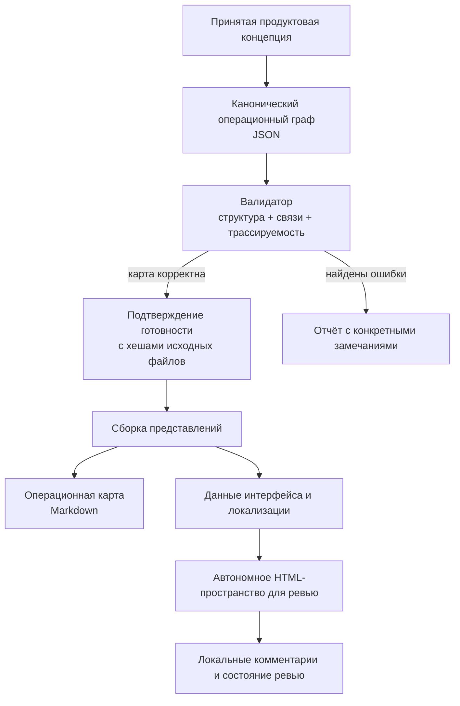
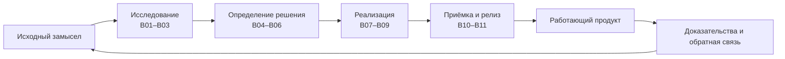

# TASKPLAN PRO Operation Map

[English version](README.md) · [npm](https://www.npmjs.com/package/taskplan-pro-operation-map) · [Безопасность](SECURITY.md) · [Лицензия](LICENSE)

TASKPLAN PRO Operation Map помогает превратить продуктовую идею в понятный и проверяемый план реализации.

Инструмент раскладывает путь от исходного замысла до релиза на связанные блоки, шаги, артефакты, решения и точки проверки. Для каждого элемента фиксируются вход, ожидаемый результат, критерии успеха, возможные причины провала и действие, которое нужно выполнить, если что-то пошло не так.

В результате команда или AI-агент видит не просто список задач, а целостную модель продукта: что должно произойти, в каком порядке, зачем нужен каждый шаг и по каким признакам можно принять результат.

> TASKPLAN PRO Operation Map не разрабатывает весь продукт самостоятельно. Он создаёт и проверяет операционную карту, на которую могут опираться разработчики, AI-агенты, оркестраторы и ревьюеры.

Репозиторий доступен для некоммерческого использования. Коммерческое использование требует предварительного письменного разрешения правообладателя. Подробнее — в разделе [Лицензия](#лицензия).

## Как это работает

Рабочий процесс выглядит так:

```text
Продуктовая концепция
        ↓
Операционный JSON-граф
        ↓
Проверка структуры и связей
        ↓
Отчёт об ошибках или подтверждение готовности
        ↓
Markdown-карта и автономный HTML для просмотра и ревью
```

Если в карте не хватает входа, результата, критерия приёмки, владельца, связи с исходной концепцией или сценария восстановления после ошибки, валидатор сообщает об этом до начала или продолжения реализации.

После успешной проверки из одного канонического JSON-графа можно собрать несколько представлений для людей и интерфейсов.



## Какой путь продукта можно описать

Карта охватывает полный цикл работы над продуктом:



Это особенно полезно в проектах, где AI-агент или команда агентов не должны перескакивать от размытого запроса сразу к большой задаче на разработку.

Вместо команды «сделай весь продукт» система заставляет разложить работу на проверяемые части и явно ответить на вопросы:

- что является входом;
- какой результат должен появиться;
- кто или что отвечает за выполнение;
- как проверить успех;
- что считать провалом;
- куда вернуться и что исправить при ошибке;
- как каждый шаг связан с принятой продуктовой концепцией.

## Что увидит пользователь

### 1. Весь продуктовый путь


Общий экран показывает одиннадцать продуктовых блоков, объединённых в четыре этапа: исследование, определение решения, реализация, приёмка и релиз.

На каждом блоке видны:

- главный вход и результат;
- состояние реализации;
- прогресс ревью;
- состояние точек проверки;
- связи с другими частями продукта.

Режим `Main pipeline` показывает основной путь без лишнего шума. Режим `All relations` добавляет корректирующие связи и маршруты восстановления после ошибок.

### 2. Содержимое отдельного блока


При открытии блока пользователь видит его рабочую структуру: шаги, создаваемые артефакты, решения, точки проверки и связи, по которым работа возвращается назад при неудачном результате.

Инспектор выбранного узла объясняет:

- что делает этот элемент;
- зачем он нужен;
- что должно поступить на вход;
- что должно появиться на выходе;
- как определить успех или провал;
- какое действие выполнить после ошибки.

### 3. Ревью отдельного элемента


У каждого элемента есть постоянный ID. Поэтому комментарии и решения не теряются при изменении расположения узлов в интерфейсе.

Для каждого узла предусмотрены отдельные поля для:

- наблюдения владельца;
- вопроса для обсуждения;
- предлагаемого решения;
- комментариев двух ревьюеров.

Состояние ревью хранится локально в браузере. Его можно экспортировать в JSON или сохранить внутри автономного HTML-файла.

## Пример применения

Допустим, команда хочет создать сервис генерации видео по текстовому описанию.

Обычный план может быстро превратиться в список из десятков задач: интерфейс, модели генерации, оплата, очередь, хранение файлов, модерация, тестирование и запуск. При этом между задачами могут остаться скрытые разрывы.

Operation Map связывает в одну модель:

- проблему и потребность пользователя;
- пользовательские сценарии;
- требования к продукту;
- архитектурные решения;
- этапы реализации;
- создаваемые артефакты;
- тесты и критерии приёмки;
- условия релиза;
- действия при ошибках.

Если, например, функция загрузки видео существует, но у неё нет критерия успешной обработки, владельца, выходного артефакта или сценария восстановления после сбоя, валидатор отметит это как конкретную проблему.

## Кому это полезно

- Соло-разработчикам, которые хотят превратить раннюю идею в реализуемую структуру продукта.
- Продуктовым архитекторам, которым нужна связь между потребностью пользователя, решениями, реализацией и доказательствами готовности.
- Командам, использующим AI-агентов для разработки и нуждающимся в ограниченных, проверяемых передачах работы.
- Ревьюерам, которым удобнее обсуждать большую систему по отдельным узлам, не редактируя исходный граф напрямую.
- Командам, которые хотят строить разные интерфейсы поверх одной модели данных: Markdown, автономный HTML, расширение VS Code или собственную панель.

## Что получает пользователь

- Один канонический граф вместо нескольких расходящихся документов и списков задач.
- Раннее обнаружение отсутствующих входов, бесхозных результатов, разорванных связей и неописанных действий при провале.
- Понятный маршрут от исходного замысла до релиза.
- Автономный HTML-файл для навигации, обсуждения и сохранения снимка состояния проекта.
- Комментарии, привязанные к постоянным ID и не зависящие от расположения элементов на экране.
- Машиночитаемый контракт, который могут использовать AI-агенты, оркестраторы и будущие интерфейсы.

## Быстрый старт

### Требования

- Node.js 18 или новее — для запуска через npm.
- Python 3.10 или новее в `PATH` — для движка операционной карты.
- Современный браузер — для автономного пространства ревью.

У npm-пакета нет JavaScript-зависимостей времени выполнения, установочных скриптов, телеметрии и обязательного сервера.

### Установка

Установить CLI глобально:

```bash
npm install --global taskplan-pro-operation-map
taskplan-operation-map --help
```

Или запустить без глобальной установки:

```bash
npx taskplan-pro-operation-map --help
```

### Использование как навыка AI-агента

Скопируйте опубликованную директорию `skill/` в директорию навыков вашего агентного окружения и вызовите `taskplan-pro-operation-map` по имени.

Путь к директории навыков зависит от среды — например, Codex, Claude или другого совместимого агентного окружения — поэтому пакет не задаёт его жёстко.

Навык объясняет агенту:

- когда нужно декомпозировать концепцию;
- какие элементы обязаны присутствовать в карте;
- какие доказательства готовности нужны;
- когда следует остановиться и запросить уточнение;
- когда можно переходить к сборке представлений и ревью.

## Команды CLI

### Проверить готовый граф

```bash
taskplan-operation-map validate \
  --graph path/to/OPERATION-MAP.json \
  --concept path/to/CONCEPT.md \
  --report build/OPERATION-MAP-AUDIT.json
```

Команда проверяет структуру графа и его связь с принятой продуктовой концепцией. Результат сохраняется в отчёт с конкретными ошибками и замечаниями.

### Собрать основные представления

```bash
taskplan-operation-map finalize \
  --graph path/to/OPERATION-MAP.json \
  --concept path/to/CONCEPT.md \
  --output-dir build/operation-map
```

Команда создаёт детерминированные представления из одного канонического графа.

### Создать пространство для ревью

```bash
taskplan-operation-map review \
  --graph path/to/OPERATION-MAP.json \
  --concept path/to/CONCEPT.md \
  --readiness-receipt path/to/OPERATION-MAP-READINESS.json \
  --output-dir build/review \
  --source-locale ru
```

Команда `review` требует подтверждение готовности и намеренно не позволяет обойти этот контракт.

Полный процесс, обязательные проверки и условия остановки описаны в [`skill/SKILL.md`](skill/SKILL.md) и материалах каталога `skill/references/`.

## Какие файлы создаются

В зависимости от команды инструмент создаёт:

- `OPERATION-MAP-AUDIT.json` — отчёт о найденных ошибках и результатах проверки;
- `OPERATION-MAP.md` — читаемое Markdown-представление карты;
- `OPERATION-MAP-PRESENTATION.json` — данные для отображения карты;
- `OPERATION-MAP-I18N.json` — каталог локализации интерфейса;
- `OPERATION-MAP-REVIEW.html` — автономное пространство для просмотра и ревью;
- `OPERATION-MAP-BUILD.json` — манифест сборки и происхождения результатов.

## Из чего состоит пакет

Этот раздел предназначен прежде всего для разработчиков и интеграторов.

- `operation_map.py` управляет валидацией, проверкой готовности и детерминированной сборкой результатов.
- JSON-контракты описывают форматы графа, подтверждения готовности, представления, локализации, состояния ревью и манифеста сборки.
- `locale_catalog.py` управляет каталогами интерфейса для RU, EN, ES, FR и DE и сохраняет информацию о происхождении переводов.
- `review_workspace.py` собирает самодостаточный HTML-файл.
- `SKILL.md` содержит инструкции для совместимого AI-агента.

## Риски и ограничения

- Даже структурно правильная карта может описывать неправильный продукт. Главным источником истины остаются принятая концепция и реальные пользовательские сценарии.
- Подтверждение готовности доказывает соблюдение формального контракта и соответствие исходным файлам, но не гарантирует честность или достаточность человеческих доказательств.
- Машинный перевод должен сохранять сведения о происхождении и может требовать проверки человеком.
- Автосохранение в интерфейсе работает через локальное хранилище браузера. Для резервной копии используйте экспорт JSON или `Save HTML`.
- Очистка данных браузера может удалить несохранённое локальное состояние.
- Плотные графы требуют масштабирования и фильтрации, особенно на небольших экранах.
- Импортируемые файлы проекта могут содержать чувствительные данные. Инструмент работает локально, но экспортированные HTML- и JSON-файлы остаются такими же чувствительными, как их источники.
- Python является обязательной зависимостью и не устанавливается автоматически через npm.
- Версия 0.2.0 реализует операционную карту и пространство ревью, но не всю будущую платформу планирования и мультиагентного выполнения TASKPLAN PRO.

## Разработка

```bash
npm test
npm pack --dry-run
```

Тесты покрывают npm-запуск, состав публикуемого пакета, валидацию графа, контракты локализации и Python-реализацию навыка.

## Лицензия

Copyright © 2026 Serge Kostenchuk.

Некоммерческое использование разрешено по условиям [TASKPLAN PRO Non-Commercial License 1.0](LICENSE).

Коммерческое использование, включая внутреннее использование в коммерческой организации, платную работу для клиентов, консалтинг, перепродажу, хостинг, SaaS или включение в коммерческий продукт, требует предварительного письменного разрешения правообладателя.

Это программное обеспечение с доступным исходным кодом (`source-available`), но не программное обеспечение с открытым исходным кодом в понимании OSI.
