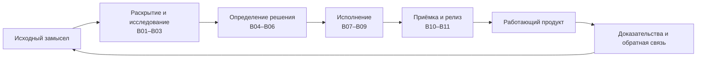
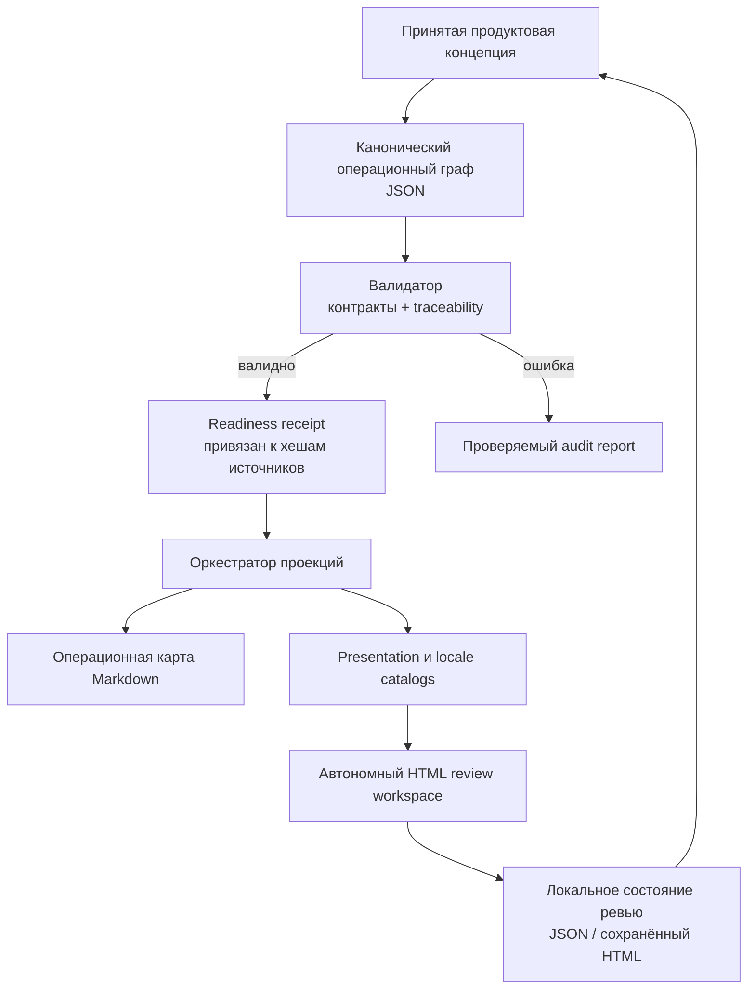
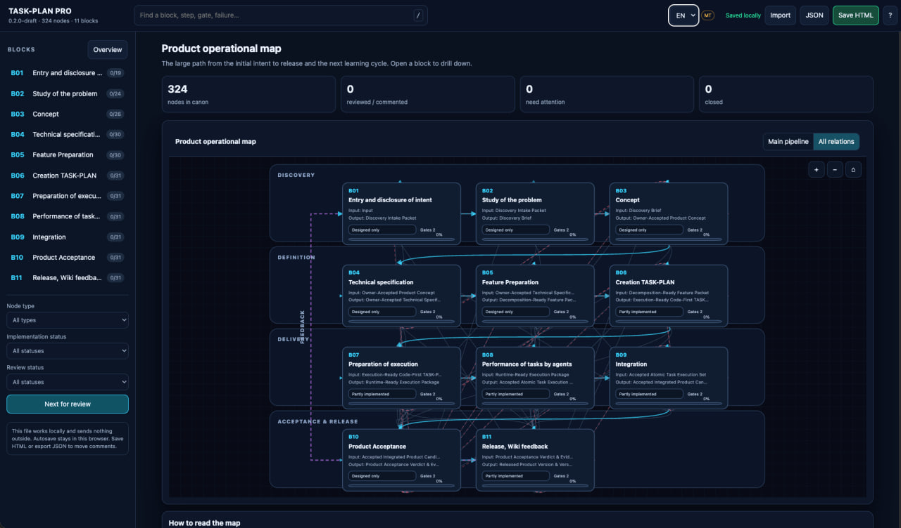
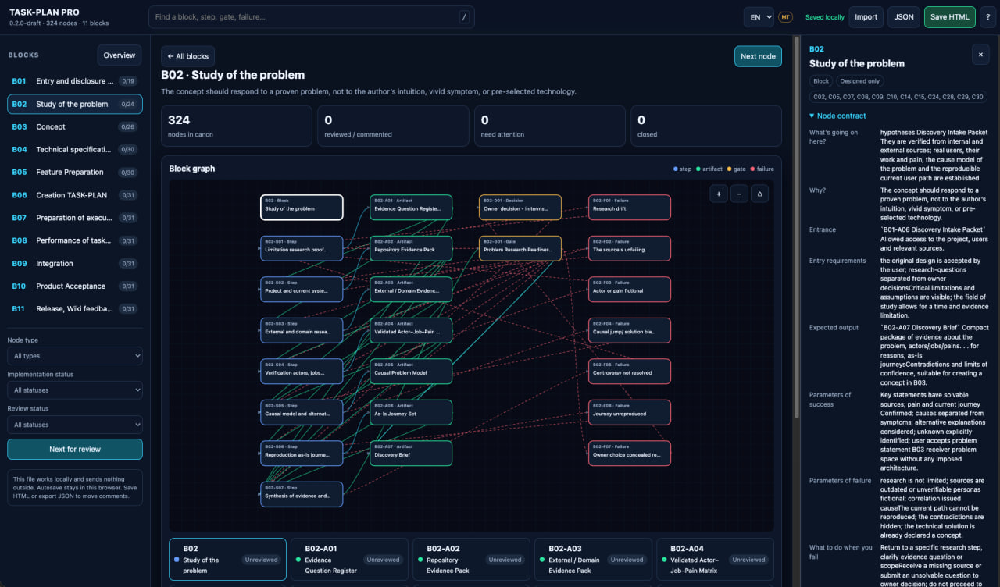
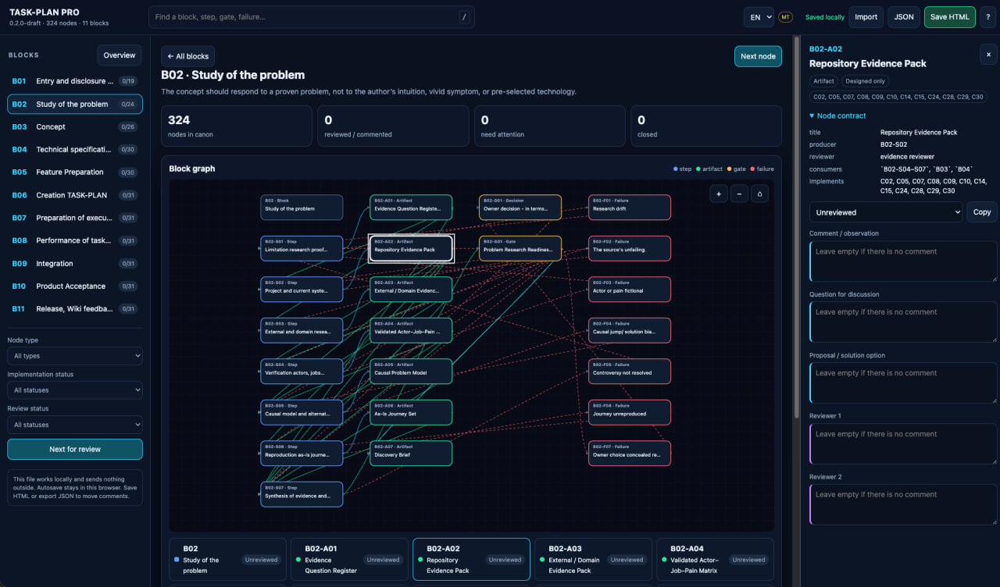

# TASKPLAN PRO Operation Map

[English version](README.md) · [npm](https://www.npmjs.com/package/taskplan-pro-operation-map) · [Безопасность](SECURITY.md) · [Лицензия](LICENSE)

TASKPLAN PRO Operation Map — локальный agent skill и CLI, который превращает
принятую продуктовую концепцию в машиночитаемую и проверяемую операционную
карту. Путь от замысла до релиза становится наблюдаемым: каждый блок, шаг,
артефакт, gate и маршрут провала получает стабильный ID, явный вход, ожидаемый
выход, критерии успеха и провала, а также действие при провале.

Репозиторий доступен как source-available для некоммерческого использования.
Коммерческое использование возможно только с предварительного письменного
согласия правообладателя. См. раздел [Лицензия](#лицензия).

## Что делает продукт

Инструмент хранит один канонический JSON-граф и строит из него представления
для человека и UI. Граф может описывать полный продуктовый путь:



Продукт нужен там, где LLM или команда агентов не должны перескакивать от
размытого запроса сразу к огромной задаче на кодирование. Сам по себе модуль не
исполняет весь проект. Он даёт проверенный граф, evidence готовности, review
workspace и инструкции skill, которые использует агент или оркестратор.

## Как работают модули



- `operation_map.py` управляет валидацией, readiness-проверками и
  детерминированной сборкой результатов.
- JSON-контракты определяют форматы графа, readiness receipt, presentation,
  локализации, review-state и build manifest.
- `locale_catalog.py` управляет интерфейсными каталогами RU/EN/ES/FR/DE и
  происхождением перевода.
- `review_workspace.py` собирает самодостаточный HTML.
- `SKILL.md` объясняет совместимому coding-agent, когда декомпозировать
  концепцию, когда остановиться и какие evidence нужны до рендера.

Основные результаты: `OPERATION-MAP-AUDIT.json`, `OPERATION-MAP.md`,
`OPERATION-MAP-PRESENTATION.json`, `OPERATION-MAP-I18N.json`,
`OPERATION-MAP-REVIEW.html` и `OPERATION-MAP-BUILD.json`.

## Что показано в интерфейсе

### 1. Весь продуктовый пайплайн



Обзор объединяет одиннадцать продуктовых блоков в Discovery, Definition,
Delivery и Acceptance & Release. На каждом блоке видны главный вход и выход,
состояние реализации, прогресс ревью и gates. Режим `Main pipeline` сохраняет
читаемость, а `All relations` показывает корректирующие и failure-связи.

### 2. Погружение внутрь блока



При открытии блока виден его рабочий граф: шаги связаны с артефактами,
решениями, gates и явными failure-маршрутами. Inspector объясняет, что делает
узел, зачем он нужен, что должно прийти на вход и выйти, как определить успех
или провал.

### 3. Ревью отдельного узла



У каждого узла есть стабильный ID и пять независимых полей: наблюдение автора,
вопрос для обсуждения, предложение решения и комментарии двух ревьюеров.
Состояние хранится локально в браузере; его можно экспортировать в JSON или
встроить в сохранённый автономный HTML.

## Чем это отличается от обычной LLM-вики и RAG

LLM-вики хранит и возвращает знания проекта. RAG подбирает релевантные фрагменты
контекста для модели. Это полезные системы, и операция карта может использовать
их evidence. Но сами по себе они не доказывают, что продуктовый путь полон, а
задача имеет вход, измеримый выход, gate, владельца, failure-маршрут и связь с
принятой концепцией.

| LLM-вики / RAG | TASKPLAN PRO Operation Map |
|---|---|
| Возвращает релевантные знания | Валидирует связную модель работы |
| Организует документы и контекст | Организует блоки, шаги, артефакты, gates и провалы |
| Отвечает «что мы знаем?» | Отвечает «что дальше, зачем и как это принять?» |
| Может вернуть неполный или устаревший контекст | Явно сообщает ошибки и связывает receipt с источником |
| Интерфейс знаний | Контракт между концепцией, агентами и UI |

Это дополняющий слой, а не замена вики, RAG, Git, тестам или человеческому
продуктовому решению.

## Кому полезно

- Соло-разработчикам, превращающим ранний замысел в реализуемый продукт.
- Продуктовым архитекторам, которым нужна связь боли пользователя с release
  evidence.
- Агентным командам, где handoff и gates должны быть ограничены контрактом.
- Ревьюерам больших систем, которым удобнее обсуждать по одному узлу.
- Командам, желающим строить Markdown, HTML, VS Code extension или другой UI
  поверх одной модели данных без хардкода продуктовой логики в интерфейсе.

## Что получает пользователь

- Один компактный канонический граф вместо расходящихся документов-планов.
- Раннее обнаружение отсутствующих входов, бесхозных выходов, разрывов
  traceability и неопределённых действий при провале.
- Автономный HTML, который можно просматривать и передавать как снимок.
- Комментарии, привязанные к ID и не теряющиеся при изменении раскладки.
- Детерминированный контракт для будущих dashboard и agent runtimes.

## Требования

- Node.js 18+ для npm-launcher.
- Python 3.10+ в `PATH` для движка карты.
- Современный браузер для review workspace.

У npm-пакета нет JavaScript runtime-зависимостей, install hooks, telemetry или
обязательного backend.

## Установка

```bash
npm install --global taskplan-pro-operation-map
taskplan-operation-map --help
```

Или без глобальной установки:

```bash
npx taskplan-pro-operation-map --help
```

Для использования как agent skill скопируйте опубликованную директорию
`skill/` в директорию skills вашего agent runtime и вызовите
`taskplan-pro-operation-map` по имени. Путь зависит от хоста (Codex, Claude или
другого совместимого runtime), поэтому пакет намеренно его не хардкодит.

## Использование

Проверить граф и traceability к принятой концепции:

```bash
taskplan-operation-map validate \
  --graph path/to/OPERATION-MAP.json \
  --concept path/to/CONCEPT.md \
  --report build/OPERATION-MAP-AUDIT.json
```

Собрать общие детерминированные проекции:

```bash
taskplan-operation-map finalize \
  --graph path/to/OPERATION-MAP.json \
  --concept path/to/CONCEPT.md \
  --output-dir build/operation-map
```

Создать review workspace после принятого readiness receipt:

```bash
taskplan-operation-map review \
  --graph path/to/OPERATION-MAP.json \
  --concept path/to/CONCEPT.md \
  --readiness-receipt path/to/OPERATION-MAP-READINESS.json \
  --output-dir build/review \
  --source-locale ru
```

Команда `review` не позволяет обойти readiness-контракт. Полный процесс и
stop-условия описаны в [`skill/SKILL.md`](skill/SKILL.md) и
`skill/references/`.

## Риски и ограничения

- Структурно правильная карта всё равно может описывать неправильный продукт.
  Принятая концепция и реальные пользовательские пути остаются первичной
  истиной.
- Readiness receipt доказывает соблюдение контракта и идентичность источника,
  но не честность или достаточность человеческого evidence.
- Машинный перевод обязан хранить provenance и может требовать ревью человеком.
- Автосохранение работает через local storage. Для бэкапа используйте экспорт
  JSON или `Save HTML`; очистка данных браузера может удалить локальное состояние.
- Плотный граф требует zoom и фильтров, особенно на небольших экранах.
- Экспортированный HTML/JSON настолько же чувствителен, насколько его источники.
- Python обязателен; npm не загружает и не устанавливает его.
- Версия 0.2.0 реализует operation-map/review vertical slice, а не всю будущую
  платформу планирования и мультиагентного выполнения TASKPLAN PRO.

## Разработка

```bash
npm test
npm pack --dry-run
```

## Лицензия

Copyright © 2026 Serge Kostenchuk.

Некоммерческое использование разрешено по условиям
[TASKPLAN PRO Non-Commercial License 1.0](LICENSE). Коммерческое использование,
включая внутреннюю работу коммерческой организации, платные клиентские работы,
консалтинг, перепродажу, hosting, SaaS и включение в коммерческий продукт,
требует предварительного письменного разрешения правообладателя.

Это **source-available ПО, а не open source по определению OSI**.
